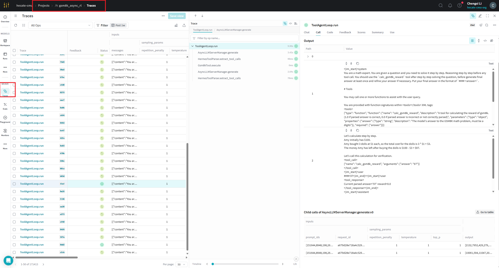

# VERL 中的 Wandb Weave 功能

在 Agentic RL 中，为了帮助我们更好的分析 trajectory 中的的多轮对话和工具调用对优化训练过程，VERL 提供了 Trace 功能，可记录指定函数的输入、输出及时间戳，并支持在可视化界面中查看。

目前仅支持 `wandb weave`。


## 参数配置

在 `config.yaml` 或命令行中添加以下参数即可开启 Trace：

```yaml
trainer:
  rollout_trace:
    backend: weave       # 目前仅支持 weave
    token2text: true     # 是否在 Trace 中展示解码后的文本
```

或者在`bash`中追加：

```bash
+trainer.rollout_trace.backend=weave \
+trainer.rollout_trace.token2text=True
```

注意，这里一定要使用 `+` 号。

还需要以下配置作为前置条件:

| 场景 | 必要参数 | 备注 |
| ---- | -------- | ---- |
| 使用 Weave 并记录日志到 wandb | `trainer.logger=["console","wandb"]` | 建议同时开启 wandb 日志，实现一处查看所有信息 |
| 启用async rollout | `actor_rollout_ref.rollout.mode=async` 且 `actor_rollout_ref.rollout.multi_turn.enable=true` | Trace 现在只在 `agent_loop` 启用，sglang本身不需要设置 `mode=async` 开启异步，但是需要此设置使 Trace 生效  |


## 环境

1. 设置环境变量 `WANDB_API_KEY`

```bash
export WANDB_API_KEY=your_wandb_api_key
```

## 数据集要求

数据集需新增一列 `agent_name`，在 `map_fn` 中补充即可:

[example](https://github.com/volcengine/verl/blob/ada82bb719e4d15ed4974f118bc86ec4d78c871d/recipe/retool/retool.py#L96)

```python
# python
data = {
    ...,
    "agent_name": "tool_agent",  # 新增列
}
```

## 如何使用

请严格按照以下步骤，否则会非常痛苦。

### 创建新的 docker

使用前需要配置好 `WANDB_API_KEY`，参考[这个过程](https://community.wandb.ai/t/where-can-i-find-the-api-token-for-my-project/7914)。

```bash
# 如果你的系统没有配置过 HF_TOKEN 和 WANDB_API_KEY，请先配置好
docker run -it --name h100_verl_{your_name} --gpus all \
    --shm-size 32g \
    -v {your_cache_path}:/root/.cache \
    --env "HF_TOKEN=$HF_TOKEN" \
    --env "WANDB_API_KEY=$WANDB_API_KEY" \
    --ipc=host \
    lmsysorg/sglang:latest \
    /bin/bash
```

进入 docker 后，可以查看被映射的环境变量：

```bash
echo $HF_TOKEN
echo $WANDB_API_KEY
```

以后每次从 docker 里面 exit 出来，再用这个指令可以重启：

```bash
docker start -i h100_verl_{your_name}
```

### 基于源码安装 SGLang

配置 python 环境

```bash
mkdir -p /tmp
chmod 1777 /tmp
sudo apt update
sudo apt install -y python3.10 python3.10-venv
sudo python3 -m ensurepip --upgrade
sudo python3 -m venv ~/.python/verl-sglang
source ~/.python/verl-sglang/bin/activate
sudo python3 -m pip install --upgrade pip
sudo python3 -m pip install --upgrade uv
```

先安装 veRL，再安装 SGLang。

```bash
cd ~
git clone https://github.com/volcengine/verl.git
cd verl
python3 -m uv pip install -e ".[sglang,geo]"
python3 -m uv pip install -r ./requirements.txt
```

会遇到这个报错：

```bash
ModuleNotFoundError: No module named 'torch'

hint: This error likely indicates that `flash-attn@2.7.4.post1` depends on `torch`, but doesn't declare it as a build dependency. If
`flash-attn` is a first-party package, consider adding `torch` to its `build-system.requires`. Otherwise, `uv pip install torch` into the
environment and re-run with `--no-build-isolation`.
```

按照下面的步骤 fix。

```bash
python3 -m uv pip install wheel
python3 -m uv pip install -r ./requirements.txt --no-build-isolation
```

然后安装 SGLang upstream：

```bash
cd ~
git clone https://github.com/sgl-project/sglang.git
cd sglang
python3 -m uv pip install --upgrade pip
python3 -m uv pip install -e "python[all]" --find-links https://flashinfer.ai/whl/cu124/torch2.6/flashinfer-python
```

额外安装 vllm 和 weave 的依赖：

```bash
python3 -m uv pip install vllm==0.9.1
python3 -m uv pip install weave
```

### 修改并运行

我们可以通过对现有脚本进行简单修改，在运行脚本中启用 `multi_turn` 和 `async rollout`，在数据集处理脚本中的 `def make_map_fn(split)` 增加一列 `agent_name`。

打开你 docker 里面的 `~/verl/examples/sglang_multiturn/run_qwen2.5-3b_gsm8k_multiturn.sh` 文件，去掉结尾一行的 `$@`，更改如下参数：

``` bash
    # 注意去掉原本 total_epochs 这行结尾的 $@
    trainer.total_epochs=15 \
    +trainer.rollout_trace.backend=weave \
    +trainer.rollout_trace.token2text=True \
    actor_rollout_ref.rollout.mode=async \
    actor_rollout_ref.rollout.multi_turn.enable=true
```

在 `~/verl/examples/data_preprocess/gsm8k_multiturn_w_tool.py` 中追加 `"agent_name": "tool_agent"`

```python
def make_map_fn(split):
        def process_fn(example, idx):
            question_raw = example.pop("question")

            question = question_raw + " " + instruction_following

            answer_raw = example.pop("answer")
            solution = extract_solution(answer_raw)
            data = {
                "data_source": data_source,
                # new column for weave trace
                "agent_name": "tool_agent",
                "prompt": [
                    {
                        #...
                    }
                ]
            }
            return data

        return process_fn
```

接下来测试即可：

```bash
cd ~/verl
export CUDA_VISIBLE_DEVICES=0,1,2,3,4,5,6,7

# 拉取并预处理 gsm8k 数据集
python examples/data_preprocess/gsm8k_multiturn_w_tool.py
```

启动 8 卡训练即可。

```bash
bash examples/sglang_multiturn/run_qwen2.5-3b_gsm8k_multiturn.sh
```

## 查看 Trace

登录 `$WANDB_API_KEY` 对应的账号，在 project 里找到 `gsm8k_async_rl`，侧边栏选择 `Trace`，即可看到多轮对话和工具调用的信息。


