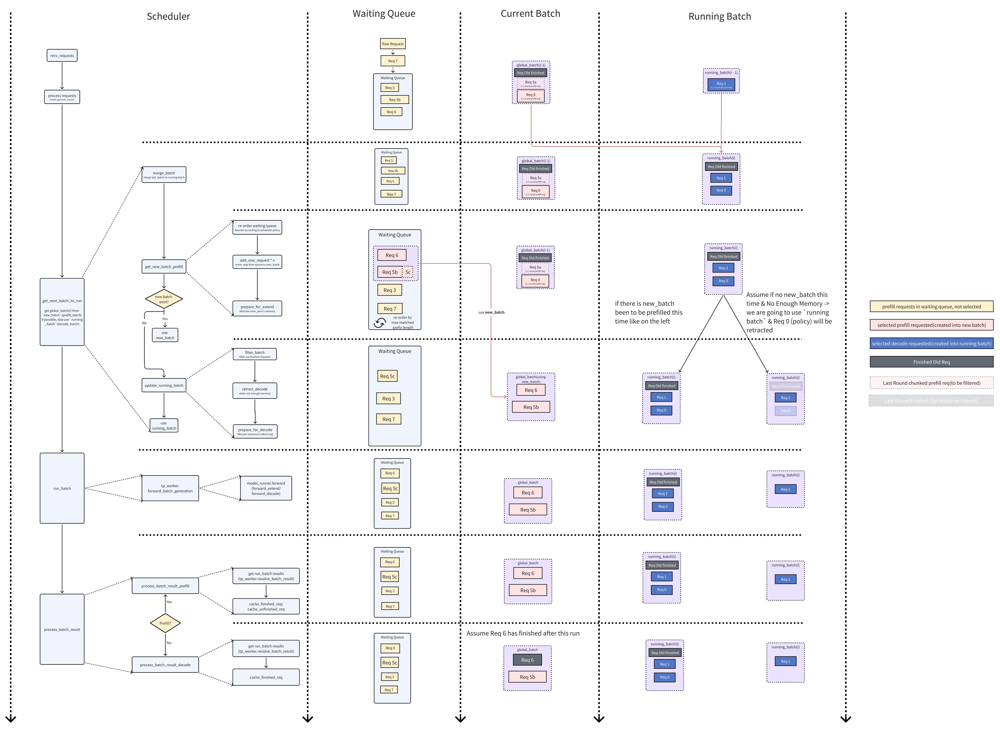

# KV Cache 代码解析
本文档提供了对 SGLang中KV Cache管理的代码实现的全面概述，追踪Request的生命周期以及涉及的关键组件，包括 `Scheduler`、 `Radix Cache`、 `Attention Backend` 和过程中维护的全局状态。

为便于说明，我们将在示例中做出以下假设：
- 我们使用 `FlashInfer` 作为`Attention Backend`
- 我们使用最长前缀（Longest Prefix）作为`waiting_queue`

## 全局状态

本节简要概述了跨Request维护的一些重要全局状态。

### KV Cache与内存池

KV Cache是服务器中最重要的全局状态，因为它可能占用 GPU 内存的很大一部分。KV Cache的管理采用了两级内存池。

#### `req_to_token_pool`
- **用途：** `req_to_token_pool` 将Request映射到其token的 KV Cache 索引。
- **布局：** 最大允许Request数 * 最大允许 token 数
- **访问：**
    - Dim0: `req_pool_indices`
    - Dim1: Request中 token 的位置，从 0、1、2 开始...
    - 值：token 的 `out_cache_loc`
  
#### `token_to_kv_pool`
- **用途：** `token_to_kv_pool` 将 token 的 KV Cache索引映射到其 KV Cache数据，`token_to_kv_pool` 有特定于模型的实现，如 `MHA`、 `MLA`、 `DoubleSparse`。
- **布局：** 层数 * 最大允许 token 数 * HEAD数 * HEAD维度
- **访问：**
    - Dim0: `layer_id`
    - Dim1: `out_cache_loc`
    - Dim2: HEAD
    - Dim3: HEAD维度
    - 值：`k_buffer` 的 `cache_k` 和 `v_buffer` 的 `cache_v`

#### `tree_cache`
- **用途：** 树结构，用于增强跨Request的前缀KV Cache复用。
- **访问：**
  - 键：Token ID
  - 值：Token 的 KV 索引

### Active Request管理

`Scheduler` 组件负责管理Active Request。以下核心全局状态用于在 `Scheduler` 中维护这些Active Request。

#### `waiting_queue`
- **用途：** `waiting_queue`是一个数据结构，设计用于存放Active Request。它根据优先级（Request的最长前缀）或可用内存动态重新排序这些Request，以优化批处理任务。
- **一些额外要点**
  - **入队**
    - 新到达的Request被加入 `waiting_queue`。
    - 从 `retract_decode` 返回的Request。
  - **出队** 当前有最高优先级的Request从队列中出队以形成批次。

#### `new_batch`
- **用途：**：一批准备好进行prefill/extend阶段的Request。
- **一些额外要点**
  - **分块预填充**：如果Request所需的 token 数超过可用内存（`remaining_tokens`），可能会被分块成较小的部分。
  - `new_batch` 中的Request将经历prefill/extend。
  - prefill/extend后，`new_batch` 将过渡到 **全局批次（Global Batch）**，用于下一次迭代。

#### `running_batch`
- **用途：**：一批准备好进行decode阶段的Request。
- **一些额外要点**
  - **Retracted**：如果decode期间可用内存不足，`Scheduler`可能会通过 `retract_decode` 从 `running_batch` 中撤回某些Request，将其返回到 `waiting_queue` 以供后续处理。

#### `cur_batch`
- **用途：**：`Scheduler` 主循环（`run_batch` 函数）中当前正在处理的Request批次。
- **一些额外要点**
  - `cur_batch` 在 `event_loop_normal` 中分配。
  - 形成 `cur_batch` 的逻辑是：如果本轮有准备好预填充的Request（`new_batch`），则使用 `new_batch` 作为 `cur_batch`。否则，`cur_batch` 将处理准备好decode的Request，因此使用 `running_batch` 作为 `cur_batch`。

## `Scheduler`概览

本节提供 `Scheduler` Request管理过程的高层概述。

### **`Scheduler`**

该图展示了 **`Scheduler`** 如何将Request从 `waiting_queue` 过渡到 `new_batch`（用于prefill/extend阶段），然后进入 `running_batch`（用于decode阶段）。

1. **新Request到达**：`Scheduler` 持续调用 `recv_requests` 以收集新到达的Request，验证它们并将其放入 `waiting_queue`。在我们的示例中，`Req 7` 被接收并入队。

2. **合并批次**：在为本轮形成新批次之前，`Scheduler` 会将上一轮的 `cur_batch` 合并到 `running_batch` 中。在图中，上一轮的 `cur_batch` 显示为 `cur_batch(i-1)`，`running_batch` 显示为 `running_batch(i-1)`。在
我们的示例中，`Req 0` 和 `Req 1` 将合并到新的 `running_batch` 中。**合并批次** 还会移除上一轮的 `being_chunked_request`。`being_chunked_request` 是在 `get_new_batch_prefill` 过程中生成的分块预填充Request。（在图中，有已完成的 `being_chunked_request`，如 `Req 5a`，表示 `Req 5` 的第一部分），我们会移除它，因为我们不希望它们进入decode阶段。）

3. **形成新批次**：`Scheduler` 会检查是否可以形成一个 `new_batch`（在 `get_new_batch_prefill` 中），所有能适应可用内存的Request将被打包到批次中。如果最后一个放入批次的Request大小超过剩余可用内存，该Request将被分块为 `being_chunked_request`。在我们的示例图中，`Scheduler` 从 `waiting_queue` 中拉取Request并创建一个 `new_batch`（如 `Req 6`、`Req 5b`，`Req 5b` 是 `being_chunked_request`），并将 `new_batch` 用作 `cur_batch`。图中未展示，但如果没有 `new_batch`，`running_batch` 将被过滤（例如，`Req 1`、`Req 0` 将被保留，而 `Old Finished Req` 将被移除），然后用作 `cur_batch`。此外，如果 GPU 内存不足，某些decode Request可能会根据特定策略被retracted。在 `retract_decode` 阶段，图中 `Req 0` 被撤回。

4. **运行批次**：一旦确定了 **全局批次**，调用 `run_batch` 执行一次前向传递。

5. **结果处理**：在 `run_batch` 之后，`Scheduler` 调用 `process_batch_result` 来确定哪些Request已完成，哪些继续进行。在我们的示例中，`Req 6` 完成并变为灰色，`Req 5b` 仍未完成。

6. **迭代**：循环重复，直到所有Request最终完成。如果遇到内存不足，Request可能会被chuncked（prefill/extend）或在retracted（decode），然后重新插入 `waiting_queue` 以供后续处理。

## 单个Request的生命周期

本节将深入介绍单个Request的生命周期，有哪些主要函数更新了KV Cache & Memory Pools。


### 关键组件
我们先来介绍一些管理KV Cache的关键组件。我们用两级内存池来管理KV Cache：

#### 1. `req_to_token_pool`
- **用途：** 将Request映射到其token的 KV cache的索引。
- **形状：** 最大允许Request数（通过 `max-running-requests` 设置） * 最大允许 token 数（通过 `model_config.context_len` 设置）
- **访问：**
    - Dim0: `req_pool_indices`
    - Dim1: 每个token在Request中的位置(0, 1, 2, ...)
    - 返回值：token 的 `out_cache_loc`

#### 2. `token_to_kv_pool`
- **用途：** 进一步将单个token从它的KV cache索引映射到其实际的KV cache数据。对于不同的注意力机制（如[`MHA`](https://arxiv.org/abs/1706.03762)、[`MLA`](https://arxiv.org/abs/2405.04434)、[`Double Sparsity`](https://arxiv.org/abs/2408.07092)），`token_to_kv_pool`可能有不同的实现。
- **形状：** decoder层数 * 最大允许 token 数 * attention头数 * 每个attention头的维度
- **访问：** 
    - Dim0：`layer_id`，该kv cache对应的层数
    - Dim1：`out_cache_loc`，token对应的kv cache索引（`req_to_token_pool`的返回值）
    - Dim2：注意力头
    - Dim3：注意力头维度
    - 返回值：`cache_k` & `cache_v`：实际的 KV cache数据

    我们通常会一次性取一整个层的kv cache，因为在前向传播中需要Request中所有先前tokens的KV。

#### 3. `tree_cache`
- **用途：** `tree_cache`是一个树结构，用于加强跨Request之间的prefix KV cache复用。`tree_cache` 负责为每个请求在token级别更新`req_to_token_pool` 和 `token_to_kv_pool`。一个token在 `tree_cache`、`req_to_token_pool` 和 `token_to_kv_pool` 之间的数据可以通过其KV Cache 索引 (`out_cache_loc`) 相互映射。
- **访问：**
  - 键：Token ID。同一个token的KV Cache与request是无关的
  - 值：Token 的 KV cache索引

### Request生命周期

带着这三个关键组件，现在我们来按照上图的流程逐步解析一个Request的生命周期。

#### Prefill
##### 1. `get_new_batch_prefill`
  - 更新radix tree cache里的前缀
    - 当 Request `ABC`到达时，假设当前radix cache里存在一个节点`AFG`
    - `match_prefix` 会尝试在当前radix cache里找到现存的`ABC`的最长前缀，也就是说它会在`AFG`节点里找到`A`
    - Radix cache会把这个节点`AFG`拆分成`A`和`FG`，`A`节点成为当前Request的最后一个节点
  - 调用 `prepare_for_extend`
    - `req_to_token_pool`
      - 分配`req_pool_indices`
      - 将前缀添加到`req_to_token_pool`
    - `token_to_kv_pool`
      - 分配【每个Request的总input token数 - match到的prefixtoken数】个`out_cache_loc`
      - 在上图的例子中，Request `ABC`的batch size为1
        - 总input token数 = 3 -> A,B,C
        - match到的prefix token数 = 1 -> A
        - 因此会分配2个`out_cache_loc`给token B, C
        
##### 2. `run_batch`
在当前batch上执行 `forward_extend`，这个到底层会调用到attention后端，attention后端负责：
- 设置要扩展（extend）的tokens的kv cache
  - 把扩展tokens的kv cache设置到`token_to_kv_pool` (`save_kv_cache`)
  - 在上图的例子中，我们在`out_cache_loc`中为B, C分配了两个位置，他们对应的K, V会被设置到这两个位置
- 运行forward attention计算，输入将是：
  - Q = 扩展tokens，在上图的例子中是B, C
  - K, V = 通过`out_cache_loc` 从 `req_to_token_pool` 里获取的所有cached tokens，包括 A（cache好的prefix token）、B、C（扩展 token）（`create_flashinfer_kv_indices_triton`）。

##### 3. `process_batch_result_prefill`
`cache_finished_req` 和 `cache_unfinished_req` 负责管理Radix Cache、`req_to_token_pool` 和 `token_to_kv_pool` 的KV cache。
- 如果Request已经完成了，调用 `cache_finished_req`（具体参考[这部分](#radixcache-cache_finished_req--cache_finished_req)）
- 如果请求未完成，调用 `cache_unfinished_req`（具体参考[这部分](#radixcache-cache_unfinished_req--cache_unfinished_req)）

在我们的例子中，`cache_unfinished_req` 在extend/prefill阶段之后被调用，`BC` 被添加为 `A` 的子节点，两个节点 `A` 和 `BC` 的锁引用次数增加，节点 `BC` 成为当前请求的 `last_node`。

#### Decode
##### 4. `update_running_batch`
- 调用 `prepare_for_decode`
  - `req_to_token_pool`：不变
  - `token_to_kv_pool`
    - 为 `out_cache_loc` 分配（batch size * 1）个slot，因为在decode模式下我们对每个batch一次只生成一个token
    - 在上图的例子中，在生成token D的轮次中，我们会为token D分配1个`out_cache_loc`

##### 5. `run_batch`
在当前batch上执行 `forward_decode`，这个到底层会调用到attention后端，attention后端负责：
- 保存decode token的kv cache
  - 将decode token的kv cache保存到`token_to_kv_pool`（`save_kv_cache`）
  - 在上图的例子中，在生成token D的迭代中，token D对应的K, V会被保存到上述第4步里为它分配的`out_cache_loc`
- 运行forward，输入将是：
  - Q = decode token，在上图的例子中是token D
  - KV = 从`req_to_token_pool`中通过`out_cache_loc`获取的所有cached tokens，包括 A, B, C（来自之前的迭代），D（`create_flashinfer_kv_indices_triton`）。

##### 6. `process_batch_result_decode`
如果Request已经完成了，调用 `cache_finished_req`（具体参考[这部分](#radixcache-cache_finished_req--cache_finished_req)）；如果一个在decode阶段的Request还未完成，我们不需要对cache进行任何操作。

在上图的例子中，`DE`会被append到`BC`节点（变成`BCDE`），节点`A`和`BCDE`的锁引用次数减少。

#### RadixCache `cache_finished_req` & `cache_unfinished_req`
本节会深入介绍`cache_finished_req` & `cache_unfinished_req`的流程。

##### **`cache_finished_req` vs. `cache_unfinished_req`**

| 步骤 | `cache_unfinished_req` | `cache_finished_req` |
|------|--------------------------|--------------------------|
| **1. 从`req_to_token_pool.req_to_token`获取`kv_indices`** | - | - |
| **2. 更新Radix Cache** (`insert()`) | - | - |
| **3. 释放KV Cache** (`self.token_to_kv_pool.free()`) | - | - |
| **4. 处理`req_to_token_pool`** | **写入和更新** `req_to_token_pool` | **释放** `req_to_token_pool` 因为Request已经完成 |
| **5. 处理`req.last_node`** | **增加** `req.last_node` 的引用计数 | **减少** `req.last_node` 的引用计数，因为 `req` 已经完成 |

可以看出`cache_unfinished_req` 和 `cache_finished_req` 的核心功能是基本相同的，下面我们将会介绍 `cache_unfinished_req()` 是如何更新Radix tree cache、`req_to_token_pool` 和 `token_to_kv_pool` 的，并解释 `cache_unfinished_req` 和 `cache_finished_req` 之间的区别。

##### `cache_unfinished_req`
1. 从`req_to_token_pool.req_to_token`获取KV indices

2. 更新Radix Cache
通过
```python
new_prefix_len = self.insert(token_ids, kv_indices.clone())
```
把token_ids和他们的KV indices插入到Radix Cache中。如果成功，会返回一个新的prefix长度（`new_prefix_len`）。
3. 释放KV Cache

4. 更新`prefix_indices`和`last_node`

   调用`match_prefix()`更新Request的`prefix_indices`和`last_node`。这里非常重要，因为`prefix_indices`和`last_node`在下一个decode的迭代会被用到。
   - `prefix_indices`用于计算需要extend/prefill的token数。
   - `last_node`用来在更新lock的时候回溯到root节点。

5. 内存安全管理
为了防止意外删除活跃的cache节点，我们用一个锁来保证使用中的节点不被释放。在上述状态转换之后，旧的`last_node`通过`dec_lock_ref()`解锁，允许它在不再需要的时候被释放。新的`last_node`被锁定，防止被意外删除。

##### `cache_finished_req`

###### **与`cache_unfinished_req()`类似，`cache_finished_req()`也有以下步骤：**
1. 当一个Request `req` 完成时，它的 `token_ids` 会被存储在 **Radix Cache** 中
2. 释放`token_to_kv_pool`中多余的KV Cache空间（移除重复）。
3. **释放 `req_to_token_pool`** 并 **更新 `tree_cache`**。
